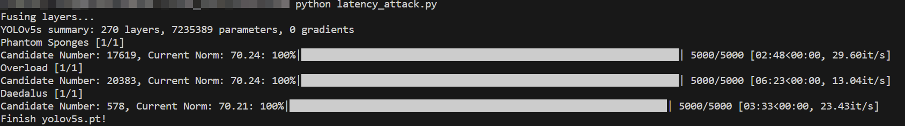

# Underload
This repository is the official implement of the CVPR 2025 paper: 
[Learning Robust and Hardware-Adaptive Object Detectors against Latency Attacks for Edge Devices](https://arxiv.org/abs/2412.02171)

## To do list
- [x] release changed ultralytics packages
- [x] release attack codes
- [ ] release AT codes
- [ ] release checkpoint and training log
- [ ] update README.md

For details on the Ultralytics package changes, see `robust_pkgs/changes.diff`

## Environment prepare
create a new python environment

```bash
conda create --name underload python=3.9
conda activate underload
```

```bash
conda install pytorch==2.0.0 torchvision==0.15.0 torchaudio==2.0.0 pytorch-cuda=11.7 -c pytorch -c nvidia
```

install other packages
```bash
pip install pickleshare pyyaml easydict opencv-python pandas matplotlib tqdm seaborn importlib-metadata requests pillow opencv-python-headless
```

install changed ultralytics packages
```bash
cd YOUR_UNDERLOAD_DIR
cd ./robust_pkgs/ultralytics-yolov5-robust-0.0.1
python setup.py install # install Ultralytics yolov5
cd ../ultralytics-main-robust
pip install . # install Ultralytics yolov8
```

## Dataset Preparation
```plaintext
datasets/
├── coco/
│   ├── train/
│   │   ├── images/
│   │   └── labels/
│   └── val/
│       ├── images/
│       └── labels/
├── VOC/
│   ├── train/
│   │   ├── images/
│   │   └── labels/
│   └── val/
│       ├── images/
│       └── labels/
└── BDD/
│   ├── train/
│   │   ├── images/
│   │   └── labels/
│   └── val/
│       ├── images/
│       └── labels/
```

## Reproduce latency attacks
Ensure prepare the correct dataset and download the demo pretrained weights ([yolov5s](https://github.com/ultralytics/yolov5/releases/download/v7.0/yolov5s.pt).
Move the weights to the a crrent directory.

```bash
mkdir weights
mv yolov5s.pt ./weights
```

Change 'img_path' in 'latency_attack.py' to the dataset image directory and 'weights_dir' to correct weights directory.

Run latency attacks and generate Universal Adversarial Patterns (UAP).
```bash
python latency_attack.py
```


